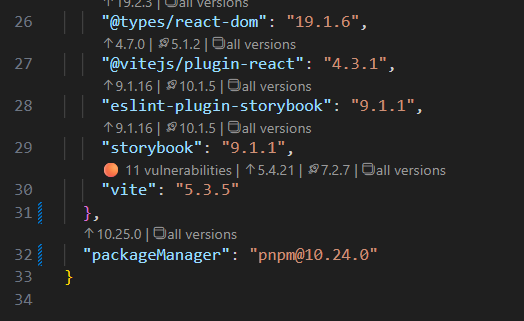
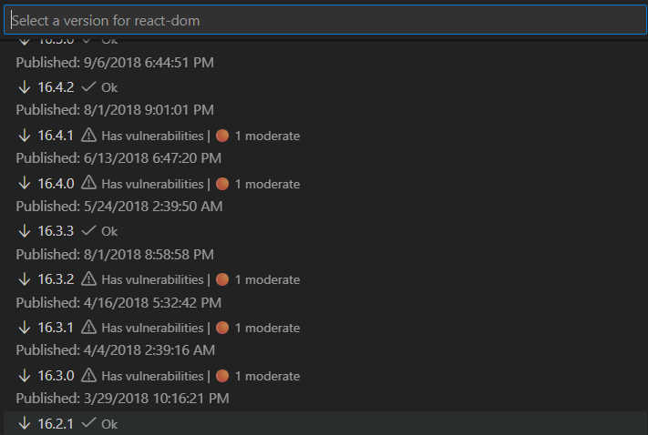
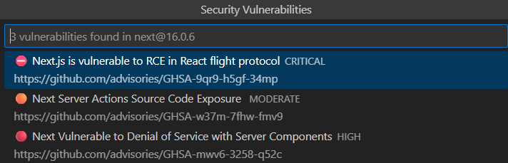
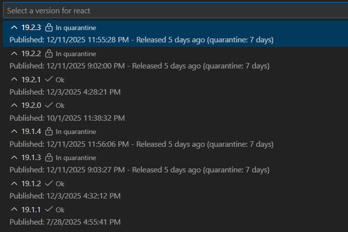

# Safer Version Lens

**Inline dependency updates with vulnerability context — so you can upgrade with fewer surprises.**

Safer Version Lens adds CodeLens to your `package.json` showing upgrade options **with vulnerability indicators**, so you can update packages without switching tabs, tools, or mental models.
It also supports **time quarantine** (pnpm/Yarn/npm configs) so you can avoid “published 6 minutes ago” releases when you're more of the conservative type.

By marking vulnerable versions **directly in your editor — before you install them** — the extension helps you stay aware of risk, for instance in the aftermath of a supply-chain attack.

> It won’t make dependency management _safe_. But it will make it _less exciting_.

---

## What you get

- **Inline version suggestions** (patch/minor/major + “all versions”)
- **Security vulnerability indicators** per version (using npm advisory data)
- **Clickable vulnerability lists** — inspect all known vulnerabilities for a version and open each advisory (CVE) directly
- **Quick-update filtering** by max allowed vulnerability severity
- **Time quarantine support** (respects your package manager’s age-gate config)
- **Caching + async fetching** to keep the editor responsive

---

## Quick Start

1. Install **Safer Version Lens** from the Marketplace
2. Open any `package.json`
3. Look above each dependency for CodeLens update actions
4. Click a version to update instantly — or browse `all versions` for details

No configuration required to get started — the extension is **enabled by default**.

---

## Screenshots

### Inline CodeLens actions



### Browse all versions with vulnerability context



### Read up on vulnerabilities for a specific version



### Time quarantine indicators



---

## Features

### 📦 Inline Version Updates

CodeLens actions appear above each dependency:

- `↑ Latest in current major` — patch/minor updates
- `🚀 Latest major` — major upgrades
- `📋 all versions` — browse full history with security context

Works with npm / pnpm / Yarn.

### 🛡️ Vulnerability Context (npm advisories)

Versions show severity indicators:

- `⛔ Critical`
- `🔴 High`
- `🟠 Moderate`
- `🟡 Low`
- `✅` None known

Clicking a version marked as vulnerable opens a detailed list of all known vulnerabilities for that version, with direct links to their advisory (CVE) pages.

Quick-update buttons can automatically **exclude versions above your configured severity threshold**.

This makes it easier to understand _what_ you’re patching — and _why_ — instead of blindly upgrading everything anything.

### 🔒 Time Quarantine Support (pnpm, Yarn & npm)

If you already use age gating, Safer Version Lens respects it:

**pnpm** (`pnpm-workspace.yaml`)

```yaml
minimumReleaseAge: 10080 # 7 days in minutes
```

**Yarn** (`.yarnrc.yml`)

```yaml
npmMinimalAgeGate: "7d"
```

**npm** (`.npmrc`)

```ini
before=2024-12-09
```

The extension will avoid suggesting versions still “too fresh”.

## Configuration (Optional)

| Setting                           | Default                    | Description                                      |
| --------------------------------- | -------------------------- | ------------------------------------------------ |
| saferVersionLens.enabled          | true                       | Enable/disable Safer Version Lens                |
| saferVersionLens.showPrerelease   | false                      | Show pre-release versions                        |
| saferVersionLens.registry         | https://registry.npmjs.org | Registry URL                                     |
| saferVersionLens.auditEnabled     | true                       | Enable vulnerability auditing                    |
| saferVersionLens.auditMaxSeverity | low                        | Max severity allowed in quick-update suggestions |

## Commands

- Safer Version Lens: Toggle Enabled
- Safer Version Lens: Toggle Pre-release Versions
- Safer Version Lens: Refresh
- Safer Version Lens: Show Configuration

## FAQ (Short)

**No CodeLens showing?**

- Check the extension is enabled (use `Toggle Enabled` command if needed)
- Open package.json
- Ensure the file contains dependencies, devDependencies, peerDependencies, or a packageManager field

**Suggestions look outdated?**

Caches network results for 30 minutes. Run Safer Version Lens: Refresh.

**Private registries?**
Yes: configure saferVersionLens.registry.

## Privacy

- Uses registry + npm advisory endpoints (read-only)
- Caches responses locally
- No telemetry
- No personal data collection

## Contributing

Repo: https://github.com/asmundwien/safer-version-lens
Issues + PRs welcome

**Enjoy calmer dependency updates. 🛡️**
